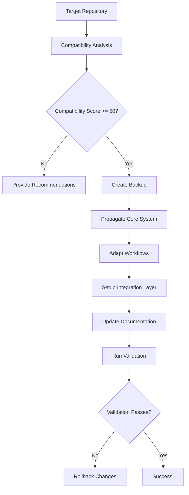

# Cross-Repository Propagation Guide

## Overview

The EpochCore RAS Cross-Repository Propagation system enables automatic deployment and adaptation of the recursive improvement system across multiple repositories and programming languages. This comprehensive toolset ensures consistent functionality while adapting to each repository's specific requirements and constraints.

## 🚀 Quick Start

### 1. Analyze Target Repository Compatibility

```bash
# Check compatibility of a single repository
python repo_compatibility_checker.py /path/to/target/repo

# Get detailed JSON output
python repo_compatibility_checker.py /path/to/target/repo --output json

# Check with remote URL for additional validation
python repo_compatibility_checker.py /path/to/target/repo --remote-url https://github.com/user/repo
```

### 2. Propagate to Single Repository

```bash
# Dry-run to see what would be done
python cross_repo_propagator.py propagate /path/to/target/repo --dry-run

# Full propagation with all modules
python cross_repo_propagator.py propagate /path/to/target/repo

# Propagate only specific modules
python cross_repo_propagator.py propagate /path/to/target/repo --modules core workflows
```

### 3. Batch Propagation to Multiple Repositories

```bash
# Use the provided example configuration
python cross_repo_propagator.py batch config/batch_propagation_example.yml --dry-run

# Execute batch propagation
python cross_repo_propagator.py batch config/batch_propagation_example.yml
```

### 4. Validate Propagated System

```bash
# Validate propagation success
python cross_repo_propagator.py validate /path/to/target/repo
```

## 🏗️ System Architecture

### Core Components

1. **CrossRepoPropagator** (`cross_repo_propagator.py`)
   - Main propagation engine
   - Handles file copying, adaptation, and validation
   - Supports multiple programming languages and repository types

2. **RepositoryCompatibilityChecker** (`repo_compatibility_checker.py`)
   - Analyzes repository compatibility before propagation
   - Scores repositories on multiple criteria
   - Provides detailed recommendations for improvements

3. **Language-Specific Setup Scripts** (`templates/`)
   - `setup_python.sh` - Python project setup
   - `setup_node.sh` - Node.js/JavaScript project setup
   - `setup_java.sh` - Java/Maven project setup
   - `setup_go.sh` - Go project setup
   - `setup_rust.sh` - Rust/Cargo project setup

4. **Configuration System** (`config/`)
   - `cross_repo_config.yml` - Main configuration
   - `batch_propagation_example.yml` - Batch operation configuration

### Propagation Flow



## 📊 Compatibility Scoring

The compatibility checker evaluates repositories across multiple dimensions:

### Scoring Categories

| Category | Weight | Description |
|----------|--------|-------------|
| Git Repository | 10 | Basic Git functionality |
| Language Support | 25 | Programming language detection and support |
| CI/CD Systems | 15 | Existing automation infrastructure |
| Testing Infrastructure | 15 | Test frameworks and coverage |
| Documentation | 10 | README, docs, and project documentation |
| Dependencies | 10 | Dependency management systems |
| Repository Structure | 10 | Organization and standard directories |
| Security Setup | 5 | Security configurations and policies |

### Compatibility Levels

- **Excellent (90-100%)**: Ready for immediate propagation
- **Good (75-89%)**: Minor setup required
- **Fair (50-74%)**: Moderate setup required
- **Poor (25-49%)**: Significant setup required  
- **Incompatible (0-24%)**: Major restructuring needed

## 🛠️ Language-Specific Adaptations

### Python Projects

**Compatibility Requirements:**
- `requirements.txt`, `pyproject.toml`, or `setup.py`
- Python 3.8+ recommended

**Adaptations Applied:**
- Virtual environment setup
- Pytest configuration
- Black/Flake8 code formatting
- GitHub Actions workflow adaptation

**Setup Command:**
```bash
./templates/setup_python.sh
```

### Node.js/JavaScript Projects

**Compatibility Requirements:**
- `package.json` file
- Node.js 16+ recommended

**Adaptations Applied:**
- NPM/Yarn dependency management
- Jest testing framework setup
- ESLint/Prettier configuration
- JavaScript wrapper for Python integration

**Setup Command:**
```bash
./templates/setup_node.sh
```

### Java Projects

**Compatibility Requirements:**
- `pom.xml` (Maven) or `build.gradle` (Gradle)
- Java 17+ recommended

**Adaptations Applied:**
- Maven project structure
- JUnit 5 testing framework
- Java wrapper class for Python integration
- Maven plugin configuration

**Setup Command:**
```bash
./templates/setup_java.sh
```

### Go Projects

**Compatibility Requirements:**
- `go.mod` file
- Go 1.19+ recommended

**Adaptations Applied:**
- Go module initialization
- Native Go integration package
- Makefile for build automation
- CLI application structure

**Setup Command:**
```bash
./templates/setup_go.sh
```

### Rust Projects

**Compatibility Requirements:**
- `Cargo.toml` file
- Rust 1.70+ recommended

**Adaptations Applied:**
- Cargo project structure
- Library and binary crate setup
- Native Rust integration with error handling
- Comprehensive testing framework

**Setup Command:**
```bash
./templates/setup_rust.sh
```

## 📋 Configuration Reference

### Cross-Repository Configuration (`config/cross_repo_config.yml`)

```yaml
# Core files always propagated
core_files:
  - "recursive_improvement/"
  - "integration.py"
  - ".github/workflows/recursive-autonomy.yml"

# Language-specific rules
adaptation_rules:
  python:
    dependency_file: "requirements.txt"
    test_command: "python -m pytest"
    setup_script: "setup_python.sh"

# Validation checks
validation_checks:
  - check_git_repo
  - check_language_support
  - check_existing_ci
```

### Batch Propagation Configuration

```yaml
repositories:
  - path: "/path/to/repo"
    type: "web_application"
    priority: "high"
    modules: ["core", "workflows", "integration"]

global_settings:
  create_backups: true
  validate_before: true
  continue_on_error: false
```

## 🔧 Advanced Usage

### Custom Adaptations

Override default adaptations by modifying the configuration:

```yaml
language_adaptations:
  python:
    setup_script: "custom_setup.sh"
    additional_files:
      - "custom_config.ini"
```

### Security and Compliance

Enable security scanning and compliance checks:

```yaml
security:
  scan_secrets: true
  check_vulnerabilities: true
  enforce_branch_protection: true
```

### Performance Optimization

Configure concurrent operations and resource limits:

```yaml
limits:
  concurrent_propagations: 3
  propagation_timeout_minutes: 30
  max_file_size_mb: 100
```

## 🚨 Troubleshooting

### Common Issues

1. **Low Compatibility Score**
   - Review compatibility checker recommendations
   - Ensure basic Git repository setup
   - Add missing dependency management files
   - Create test directories and basic documentation

2. **Propagation Failures**
   - Check file permissions on target repository
   - Verify Python and EpochCore RAS are properly installed
   - Review error messages in propagation output
   - Use rollback functionality if needed

3. **Language Detection Issues**
   - Ensure language-specific files are present
   - Check file extensions match supported patterns
   - Verify configuration files are in expected locations

4. **Integration Validation Failures**
   - Confirm Python dependencies are installed
   - Check integration.py script is present and executable
   - Verify virtual environment is activated (Python)
   - Test manual execution of integration commands

### Recovery Procedures

1. **Rollback Failed Propagation**
   ```bash
   # Automatic backup restoration (if backups were created)
   cp -r /path/to/backup/* /path/to/repository/
   ```

2. **Manual Cleanup**
   ```bash
   # Remove propagated EpochCore files
   rm -rf recursive_improvement/
   rm -f integration.py
   rm -f .github/workflows/recursive-autonomy.yml
   ```

## 📈 Best Practices

### Pre-Propagation

1. **Repository Preparation**
   - Ensure clean git status
   - Create feature branch for EpochCore integration
   - Review and commit any pending changes
   - Configure proper branch protection rules

2. **Compatibility Analysis**
   - Run compatibility checker first
   - Address critical issues before propagation
   - Document any custom adaptations needed
   - Plan rollback strategy

### During Propagation

1. **Monitoring**
   - Use dry-run mode first to preview changes
   - Monitor disk space and resource usage
   - Keep logs of all operations
   - Validate each step before proceeding

2. **Error Handling**
   - Don't ignore warnings in compatibility checks
   - Address file permission issues immediately
   - Test integration functionality early
   - Document any manual interventions needed

### Post-Propagation

1. **Validation**
   - Run full system validation
   - Test language-specific integration
   - Verify GitHub Actions workflow functionality
   - Check all propagated files for correctness

2. **Integration Testing**
   - Execute sample workflows
   - Test recursive improvement system
   - Validate dashboard functionality
   - Confirm proper logging and monitoring

3. **Documentation**
   - Update repository-specific documentation
   - Document any custom configurations
   - Create deployment and maintenance guides
   - Share lessons learned with team

## 🤝 Contributing

### Adding New Language Support

1. Create setup script in `templates/setup_<language>.sh`
2. Add language detection rules to `cross_repo_propagator.py`
3. Update configuration files with language-specific rules
4. Create integration wrapper for the language
5. Add comprehensive tests and documentation

### Improving Compatibility Detection

1. Extend scoring categories in `repo_compatibility_checker.py`
2. Add new validation checks
3. Improve recommendation system
4. Test with diverse repository types

### Enhancing Adaptations

1. Create more sophisticated adaptation rules
2. Add support for additional CI/CD systems
3. Improve error handling and recovery
4. Add monitoring and metrics collection

## 📚 References

- [EpochCore RAS Main Documentation](README.md)
- [Recursive Improvement Architecture](docs/ARCHITECTURE.md)
- [GitHub Actions Workflow Guide](.github/workflows/recursive-autonomy.yml)
- [Cross-Repository Configuration Reference](config/cross_repo_config.yml)