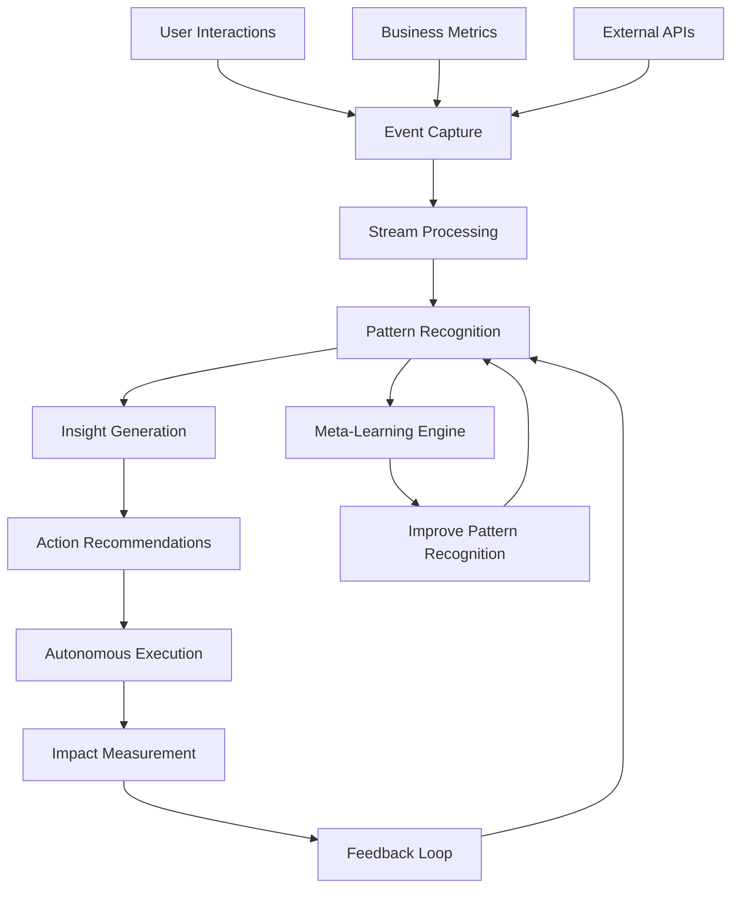

# EpochCore RAS - System Architecture

## 🏗️ Autonomous System Architecture Overview

This document outlines the architecture for building recursive autonomous systems that self-monitor, self-optimize, and self-expand across multiple domains.

## 🎯 Core Architectural Principles

### 1. Hierarchical Autonomy
```
Sovereign Layer    → Create new businesses from insights
     ↑
Commander Layer    → Allocate resources, manage focus  
     ↑
Architect Layer    → Redesign systems and workflows
     ↑
Strategist Layer   → Track KPIs, suggest experiments
     ↑
Executor Layer     → Execute workflows and SOPs
```

### 2. Recursive Improvement Stack
```
Meta-Meta Learning → Improve how we improve improvements
     ↑
Meta Learning     → Improve how we improve systems
     ↑
System Learning   → Improve system performance
     ↑
Base Operation    → Core business functionality
```

### 3. Cross-Domain Integration
```
Product ←→ Marketing ←→ Pricing ←→ Support ←→ Analytics
   ↕        ↕           ↕        ↕        ↕
Content ←→ UX/UI    ←→ Sales  ←→ Operations
   ↕        ↕           ↕        ↕
E-commerce ←→ IoT   ←→ SaaS  ←→ Infrastructure
```

## 🧠 System Components

### 1. Autonomous Feedback Loop Engine
```typescript
interface FeedbackLoopEngine {
  // Data Collection
  collectPerformanceData(): PerformanceData;
  collectUserBehaviorData(): UserData;
  collectMarketData(): MarketData;
  
  // Analysis & Learning
  analyzePatterns(data: AllData): InsightPatterns;
  generateHypotheses(patterns: InsightPatterns): Hypothesis[];
  
  // Action & Experimentation  
  designExperiments(hypotheses: Hypothesis[]): Experiment[];
  executeExperiments(experiments: Experiment[]): Results[];
  
  // Recursive Improvement
  improveAnalysisMethod(): void;
  improveExperimentDesign(): void;
  improveImprovementProcess(): void; // Meta-recursion
}
```

### 2. Multi-Agent Orchestration System
```python
class AutonomousAgentOrchestrator:
    """
    Manages multiple AI agents that collaborate on different
    aspects of the business with recursive coordination.
    """
    def __init__(self):
        self.agents = {
            'content_agent': ContentGenerationAgent(),
            'pricing_agent': PricingOptimizationAgent(),
            'user_agent': UserAnalysisAgent(),
            'marketing_agent': MarketingAutomationAgent(),
            'support_agent': CustomerSupportAgent(),
            'analytics_agent': AnalyticsAgent()
        }
        self.coordination_protocols = []
        self.meta_coordinator = MetaCoordinationAgent()
    
    def orchestrate_agents(self, business_context):
        """Coordinate all agents for optimal business outcomes"""
        # Assign tasks based on current context
        task_assignments = self.assign_tasks(business_context)
        
        # Execute tasks in parallel with coordination
        results = self.execute_coordinated_tasks(task_assignments)
        
        # Learn from inter-agent collaboration patterns
        collaboration_insights = self.analyze_collaboration(results)
        
        # Improve coordination protocols
        self.improve_coordination_protocols(collaboration_insights)
        
        # Recursively improve coordination improvement
        self.meta_coordinator.improve_improvement_process()
        
        return results
```

### 3. Recursive Experimentation Framework
```python
class RecursiveExperimentationFramework:
    """
    Autonomous experimentation system that runs A/B tests,
    analyzes results, and recursively improves experiment design.
    """
    def __init__(self):
        self.experiment_designer = ExperimentDesigner()
        self.hypothesis_generator = HypothesisGenerator()
        self.results_analyzer = ResultsAnalyzer()
        self.meta_experimenter = MetaExperimenter()
    
    def run_experimentation_cycle(self):
        """Execute full experimentation cycle with recursive improvement"""
        
        # Generate hypotheses based on current data
        hypotheses = self.hypothesis_generator.generate_hypotheses()
        
        # Design experiments for hypotheses
        experiments = self.experiment_designer.design_experiments(hypotheses)
        
        # Execute experiments
        results = self.execute_experiments(experiments)
        
        # Analyze results and extract insights
        insights = self.results_analyzer.analyze_results(results)
        
        # Generate new hypotheses from results (recursive)
        follow_up_hypotheses = self.generate_follow_up_hypotheses(insights)
        
        # Improve experiment design based on effectiveness
        self.experiment_designer.improve_design_strategy(results)
        
        # Improve hypothesis generation strategy
        self.hypothesis_generator.improve_generation_strategy(insights)
        
        # Meta-improve: improve how we improve experiments
        self.meta_experimenter.improve_improvement_strategies()
        
        return insights, follow_up_hypotheses
```

## 🔄 Data Flow Architecture

### Real-time Data Pipeline


### Knowledge Graph Evolution
```python
class EvolvingKnowledgeGraph:
    """
    Knowledge graph that continuously learns and evolves
    its understanding of business relationships.
    """
    def __init__(self):
        self.graph = BusinessKnowledgeGraph()
        self.relationship_learner = RelationshipLearner()
        self.graph_evolver = GraphEvolver()
    
    def update_knowledge(self, new_data):
        """Update knowledge graph with new insights"""
        # Extract relationships from new data
        new_relationships = self.relationship_learner.extract_relationships(new_data)
        
        # Update graph structure
        self.graph.add_relationships(new_relationships)
        
        # Validate and refine relationships
        refined_relationships = self.validate_relationships(new_relationships)
        
        # Evolve graph structure for better representation
        self.graph_evolver.evolve_graph_structure(refined_relationships)
        
        # Recursively improve relationship learning
        self.relationship_learner.improve_extraction_method()
```

## 💾 Technology Stack Architecture

### Infrastructure Layer
```yaml
infrastructure:
  compute:
    - Railway (auto-scaling backend)
    - Render (serverless functions)
    - Supabase (database + real-time)
  
  ai_services:
    - OpenAI GPT (content generation, analysis)
    - LangChain (AI orchestration)
    - Vector databases (embeddings, similarity search)
  
  data_pipeline:
    - PostHog (product analytics)
    - Mixpanel (user behavior tracking)
    - Custom event streaming
  
  automation:
    - Zapier (workflow automation)
    - Make (complex integrations)
    - GitHub Actions (CI/CD)
```

### Application Layer
```typescript
interface ApplicationArchitecture {
  // Core Business Logic
  productManagement: ProductManagementSystem;
  userManagement: UserManagementSystem;
  contentManagement: ContentManagementSystem;
  
  // AI-Powered Systems
  contentGenerator: RecursiveContentGenerator;
  pricingOptimizer: RecursivePricingOptimizer;
  userAnalyzer: RecursiveUserAnalyzer;
  marketingAutomator: RecursiveMarketingSystem;
  
  // Meta-Systems (Recursive Improvement)
  metaLearner: MetaLearningSystem;
  systemOrchestrator: SystemOrchestrator;
  performanceMonitor: RecursivePerformanceMonitor;
  
  // Integration Layer
  apiGateway: APIGateway;
  eventBus: EventBus;
  dataSync: DataSynchronizer;
}
```

## 🎯 Autonomous Decision-Making Framework

### Decision Hierarchy
```python
class AutonomousDecisionFramework:
    """
    Hierarchical decision-making system that operates
    at multiple levels of autonomy.
    """
    def __init__(self):
        self.decision_layers = {
            'operational': OperationalDecisionEngine(),    # Immediate actions
            'tactical': TacticalDecisionEngine(),          # Short-term strategy
            'strategic': StrategicDecisionEngine(),        # Long-term planning
            'sovereign': SovereignDecisionEngine()         # Business creation
        }
        self.decision_coordinator = DecisionCoordinator()
    
    def make_autonomous_decision(self, context, urgency_level):
        """Make decisions at appropriate autonomy level"""
        # Determine decision level based on context and urgency
        decision_level = self.determine_decision_level(context, urgency_level)
        
        # Get decision from appropriate engine
        decision = self.decision_layers[decision_level].make_decision(context)
        
        # Coordinate with other decision layers
        coordinated_decision = self.decision_coordinator.coordinate_decision(
            decision, decision_level, context
        )
        
        # Learn from decision outcomes
        self.learn_from_decision_outcome(coordinated_decision)
        
        # Recursively improve decision-making process
        self.improve_decision_making(decision_level)
        
        return coordinated_decision
```

### Context-Aware Adaptation
```python
class ContextAwareSystem:
    """
    System that adapts its behavior based on current context
    and recursively improves its context understanding.
    """
    def __init__(self):
        self.context_analyzer = ContextAnalyzer()
        self.adaptation_engine = AdaptationEngine()
        self.meta_adapter = MetaAdapter()
    
    def adapt_to_context(self, current_context):
        """Adapt system behavior to current context"""
        # Analyze context for key factors
        context_factors = self.context_analyzer.analyze_context(current_context)
        
        # Determine required adaptations
        adaptations = self.adaptation_engine.determine_adaptations(context_factors)
        
        # Apply adaptations
        self.apply_adaptations(adaptations)
        
        # Learn from adaptation effectiveness
        adaptation_effectiveness = self.measure_adaptation_effectiveness()
        
        # Improve adaptation strategies
        self.adaptation_engine.improve_strategies(adaptation_effectiveness)
        
        # Meta-improve: improve how we improve adaptations
        self.meta_adapter.improve_improvement_process()
```

## 📊 Monitoring & Observability

### Multi-Level Performance Monitoring
```python
class RecursivePerformanceMonitor:
    """
    Monitor performance at multiple levels:
    - Business metrics (revenue, users, etc.)
    - System performance (latency, errors, etc.)  
    - AI performance (accuracy, efficiency, etc.)
    - Meta-performance (improvement rates, etc.)
    """
    def __init__(self):
        self.metric_collectors = {
            'business': BusinessMetricCollector(),
            'system': SystemMetricCollector(),
            'ai': AIMetricCollector(),
            'meta': MetaMetricCollector()
        }
        self.anomaly_detector = AnomalyDetector()
        self.insight_generator = InsightGenerator()
    
    def monitor_all_levels(self):
        """Monitor performance at all system levels"""
        all_metrics = {}
        
        # Collect metrics from all levels
        for level, collector in self.metric_collectors.items():
            all_metrics[level] = collector.collect_metrics()
        
        # Detect anomalies across levels
        anomalies = self.anomaly_detector.detect_anomalies(all_metrics)
        
        # Generate insights from metrics and anomalies
        insights = self.insight_generator.generate_insights(all_metrics, anomalies)
        
        # Trigger autonomous responses to insights
        self.trigger_autonomous_responses(insights)
        
        # Recursively improve monitoring effectiveness
        self.improve_monitoring_strategy(insights)
        
        return all_metrics, anomalies, insights
```

## 🚀 Deployment & Scaling Architecture

### Auto-Scaling Infrastructure
```yaml
deployment:
  compute_scaling:
    - Auto-scale based on demand
    - Serverless functions for burst capacity
    - Edge computing for global distribution
  
  data_scaling:
    - Distributed databases
    - Automatic data partitioning
    - Real-time replication
  
  ai_scaling:
    - Model serving with auto-scaling
    - Batch processing for heavy computations
    - Edge inference for low latency
```

### Continuous Deployment Pipeline
```python
class AutonomousDeploymentSystem:
    """
    Deployment system that automatically deploys, tests,
    and rolls back based on performance metrics.
    """
    def __init__(self):
        self.deployment_engine = DeploymentEngine()
        self.performance_monitor = PerformanceMonitor()
        self.rollback_system = RollbackSystem()
    
    def autonomous_deploy(self, new_version):
        """Deploy new version with autonomous monitoring and rollback"""
        # Deploy to staging environment
        staging_deployment = self.deployment_engine.deploy_to_staging(new_version)
        
        # Run automated tests
        test_results = self.run_comprehensive_tests(staging_deployment)
        
        if test_results.passed:
            # Deploy to production with gradual rollout
            production_deployment = self.deployment_engine.gradual_deploy(new_version)
            
            # Monitor performance in real-time
            performance_metrics = self.performance_monitor.monitor_deployment(
                production_deployment
            )
            
            # Autonomous rollback if performance degrades
            if performance_metrics.degraded:
                self.rollback_system.autonomous_rollback(production_deployment)
            else:
                # Complete deployment and learn from success
                self.deployment_engine.complete_deployment(production_deployment)
                self.learn_from_successful_deployment(performance_metrics)
```

## 🔄 Next Steps for Implementation

### Phase 1: Core Infrastructure
1. Set up basic feedback loop systems
2. Implement simple autonomous decision-making
3. Create performance monitoring dashboards
4. Deploy basic AI integration

### Phase 2: Recursive Capabilities  
1. Add meta-learning to existing systems
2. Implement recursive improvement algorithms
3. Create autonomous experimentation framework
4. Deploy multi-agent coordination

### Phase 3: Advanced Autonomy
1. Implement full recursive decision-making
2. Deploy autonomous cloning and verticalization
3. Create sovereign-level business creation
4. Achieve full autonomous operation

This architecture provides the foundation for building truly autonomous systems that not only operate independently but continuously evolve and improve their own capabilities.